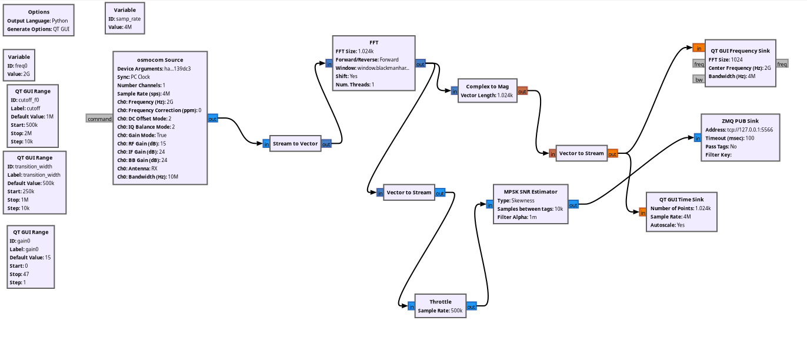

# Summary

The following folder has both the associated `.py` and `.grc` files for the flowgraph. The flowgraph is what our system uses in order to obtain a signal, the calculated SNR, and sends it off via ZMQ.

## Block Diagram

